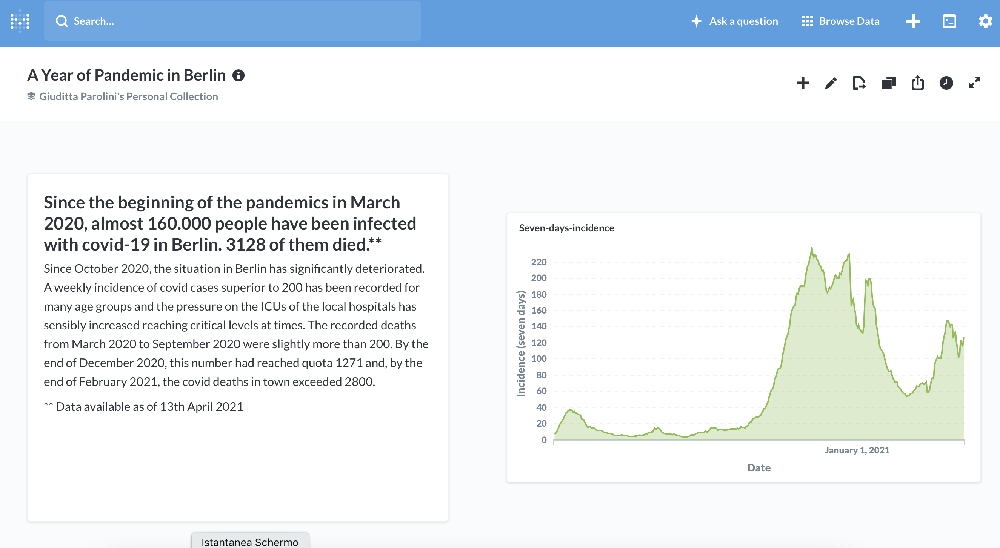
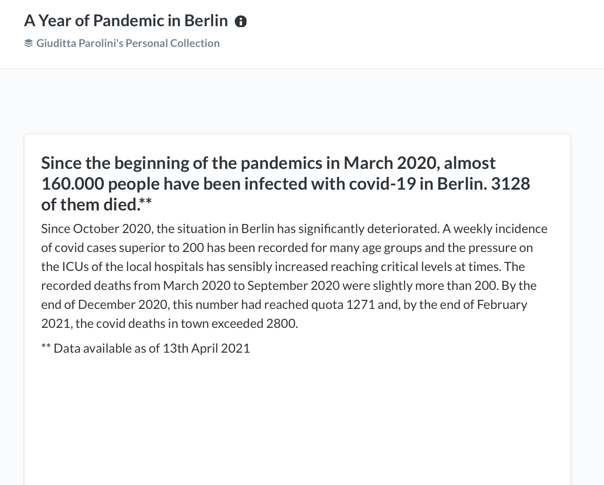
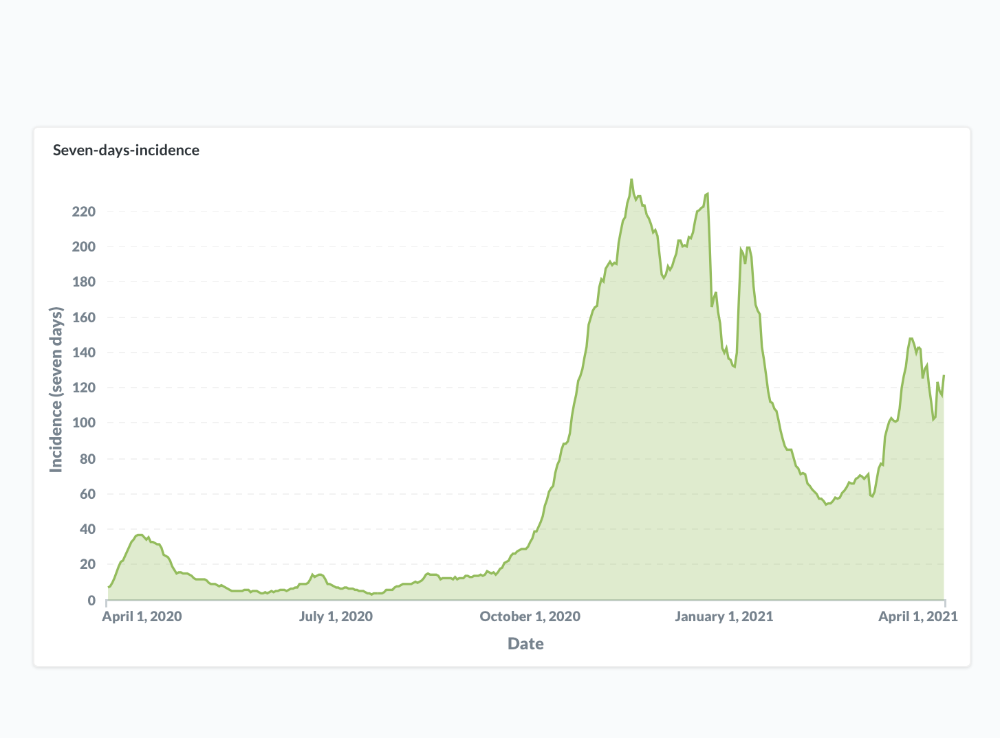
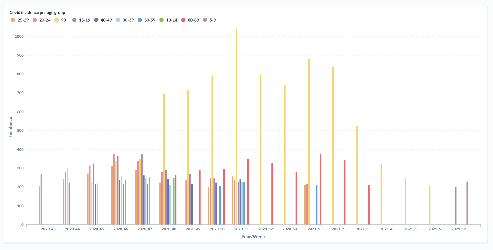
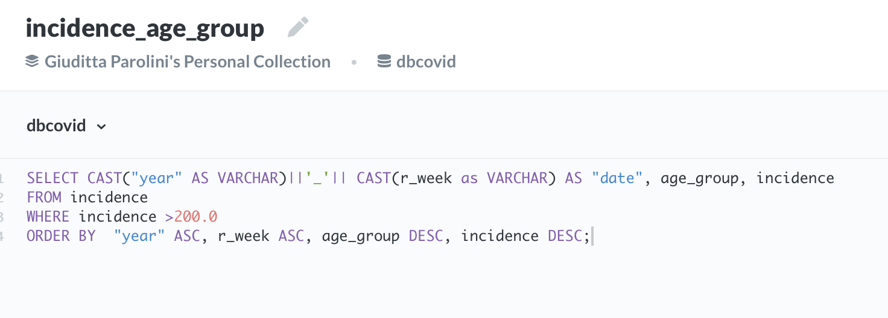
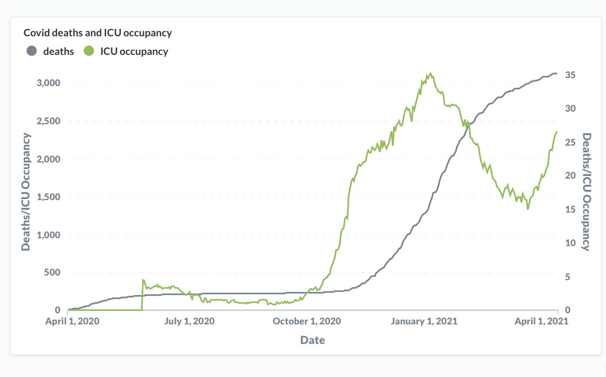

# Project 5: Dashboard - Berlin covid-19 data

The project was developed during the Spiced Academy Data Science Bootcamp using **PostgreSQL** and **AWS cloud services**. Data on the covid-19 pandemic in Berlin were extracted from the information provided by LAGeSo (Landesamt für Gesundheit und Soziales) and cover the period March 2020 to 13 April 2021.

 

Data sources: 
* https://daten.berlin.de/datensaetze/covid-19-fälle-im-land-berlin-verteilung-nach-altersgruppen;
* https://daten.berlin.de/datensaetze/covid-19-berlin-verteilung-den-bezirken-gesamtübersicht;
* https://daten.berlin.de/datensaetze/covid-19-berlin-verteilung-den-bezirken;
* https://daten.berlin.de/datensaetze/covid-19-berlin-fallzahlen-und-indikatoren-gesamtübersicht; https://daten.berlin.de/datensaetze/covid-19-fälle-im-land-berlin-7tage-inzidenz-nach-altersgruppen-und-meldewochen.

 

## Dashboard structure
 

 

The dashboard is composed of six widgets: one introductory text box summarising the main data related to the development of the pandemics in Berlin (people infected with covid-19 so far, deaths, key stages of development) and four plots (incidence of the covid-19 cases over seven days, covid-19 incidence per age group, deaths due to covid-19 and occupancy of the intensive care units (ICU) in the local hospitals by covid patients, distribution of the covid cases per borough.

 

The dashboard has been created using the open source version of the software [metabase](https://www.metabase.com). AWS services were used for hosting in the cloud the postgreSQL database and the EC2 instance running metabase.

 

The data used in the dashboard cover the period from the beginning of the pandemics to 13th April 2021, when the data tables were downloaded. Potentially, the data could be updated daily by connecting to the APIs created by LAGESO. However, before entering them in the database they need proper cleaning (removing Umlaute not recognised by the UFT-8 codification, transforming the formats of numeric data, etc.).

 

## Dashboard content

 
1. Summary  
2. Total Covid-19 incidence over seven days  
3. Covid-19 incidence per age group over seven days  
4. Covid-19 deaths and ICU occupancy  
5. Covid-19 cases per borough  
 

#### Summary
Short text box with key data about the development of the pandemic in Berlin.

 

#### Total Covid-19 incidence over seven days
Opening plot, chosen as such because the Berlin public authorities use the incidence of covid-19 cases over seven days as a main criterion to take action.

 

#### Covid-19 incidence per age group over seven days
The plot provides an insight into how different age groups have been affected by covid-19. In order to plot in chronological order (from 2020 to 2021) the incidence data disaggregated per age group, it was necessary to regroup the time information casting year and week as VARCHAR and joining them to write a unique time information (see SQL query below).

 

#### Covid-19 deaths and ICU occupancy
The plot displays the covid-19 deaths and ICU occupancy. Berlin public authorities considered also the ICU occupancy as a key factor in the development of the epidemics.

 

#### Covid-19 cases per borough
Distribution of the covid-19 cases according to the Berlin borough in which they were registered. Due to limitations in the metabase software, it was not possible to insert a map of the Berlin boroughs. A link to an open source is provided.

 

## Dashboards as data stories
By examining the dashboard, it becomes evident that the covid pandemics did not hit Berlin much for the first months (March 2020 to April 2020), but since October 2020, the situation has significantly deteriorated. A weekly incidence of covid cases superior to 200 has been recorded for many age groups and the pressure on the ICUs of the local hospitals has sensibly increased reaching critical levels at times. Quite significantly, the recorded deaths from March 2020 to September 2020 were slightly more than 200. By the end of December 2020, this number had reached quota 1271 and, by the end of February 2021, the covid deaths in town exceeded 2800.
